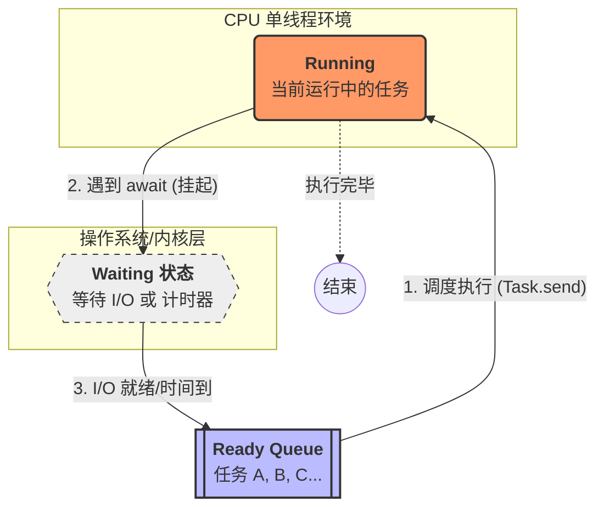

# my-fastapi
Learn The FastAPI

### Event Loop

```mermaid
graph TD
    %% 定义状态节点
    subgraph Single_Thread [CPU 单线程环境]
        Running(<b>Running</b><br/>当前运行中的任务)
    end

    Ready_Queue[[<b>Ready Queue</b><br/>任务 A, B, C...]]
    
    subgraph OS_Level [操作系统/内核层]
        Waiting{{<b>Waiting 状态</b><br/>等待 I/O 或 计时器}}
    end

    %% 状态流转逻辑
    Ready_Queue -- "1. 调度执行 (Task.send)" --> Running
    Running -- "2. 遇到 await (挂起)" --> Waiting
    Waiting -- "3. I/O 就绪/时间到" --> Ready_Queue

    %% 循环逻辑说明
    Running -.-> |"执行完毕"| Done((结束))
    
    style Running fill:#f96,stroke:#333,stroke-width:2px
    style Ready_Queue fill:#bbf,stroke:#333,stroke-width:2px
    style Waiting fill:#eee,stroke:#333,stroke-dasharray: 5 5

```
